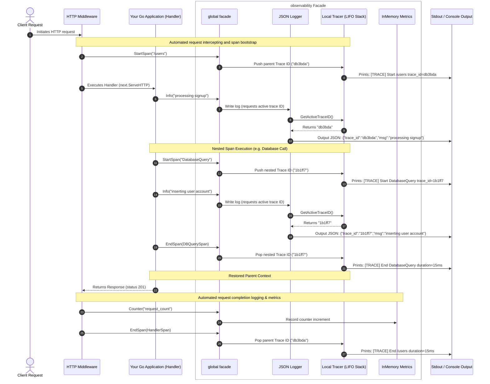
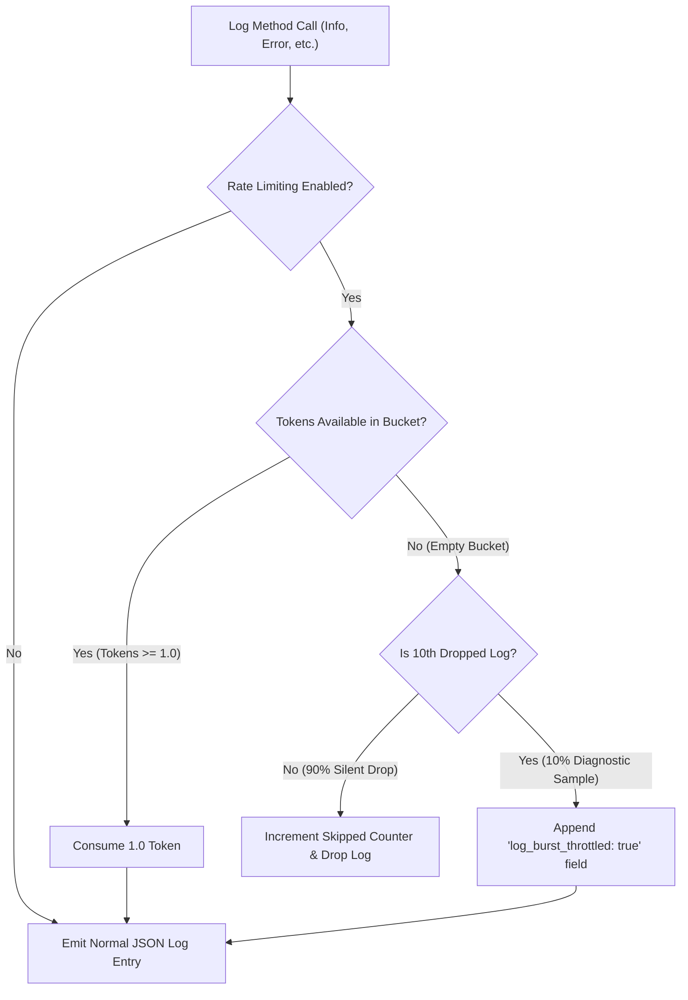
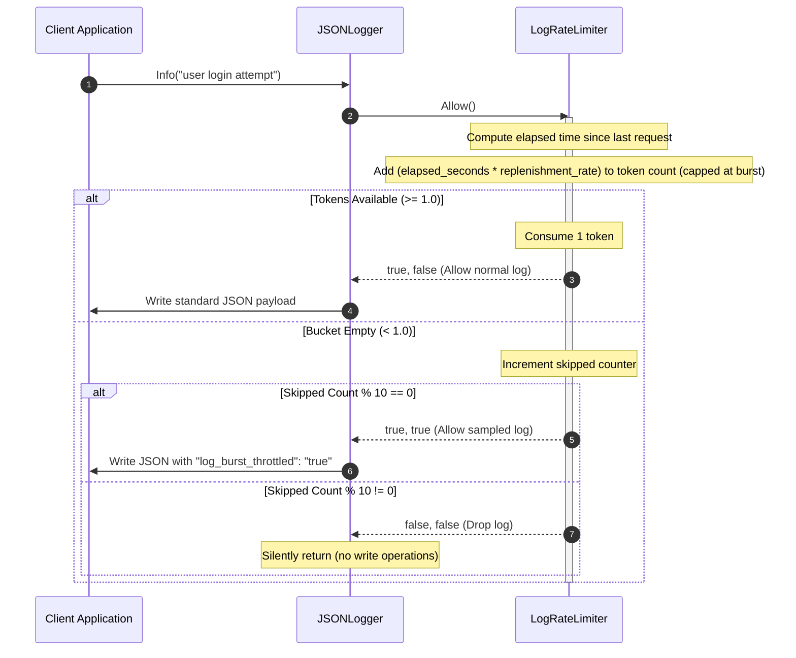
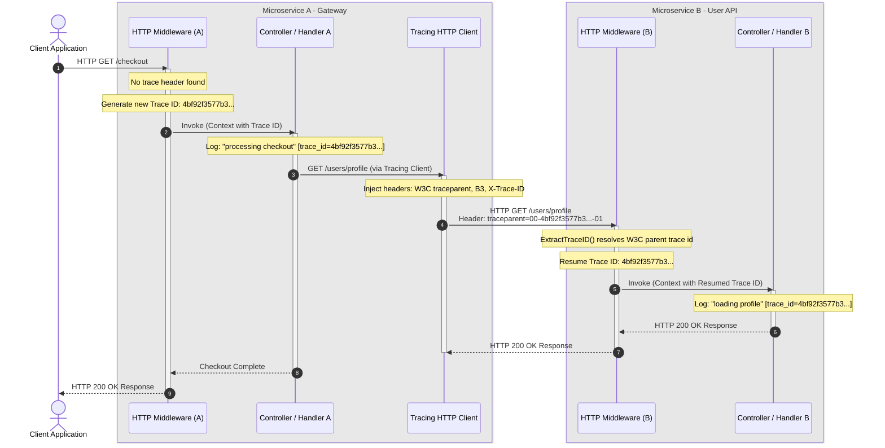
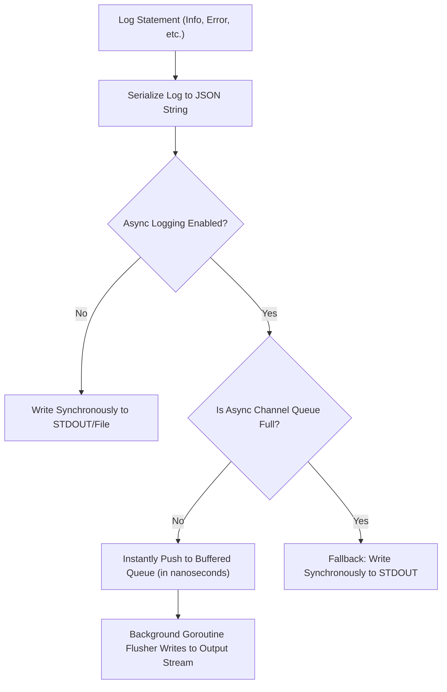
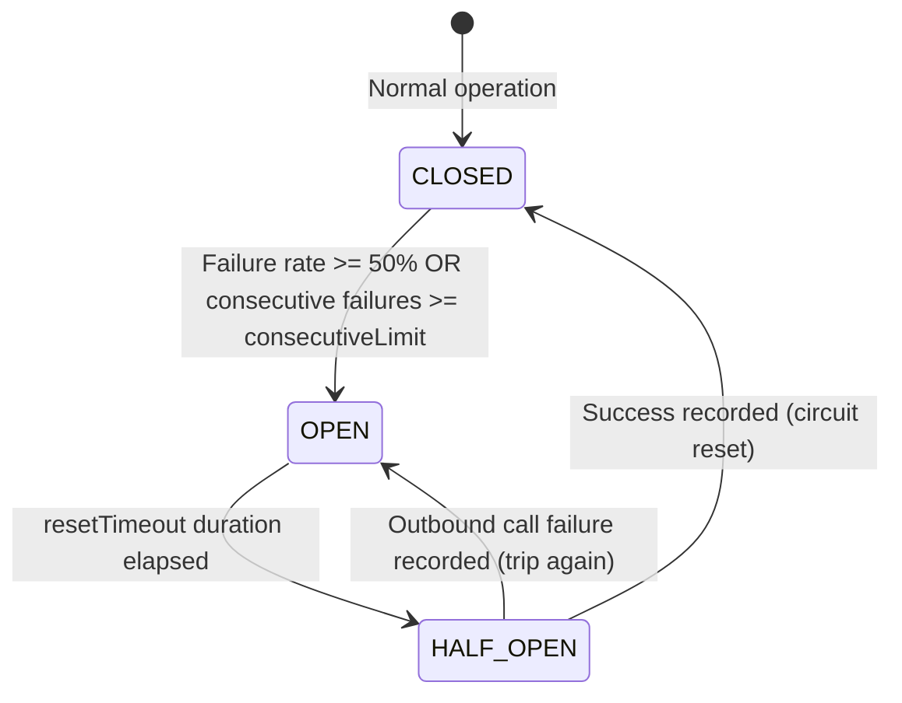
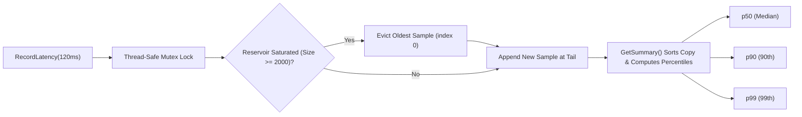
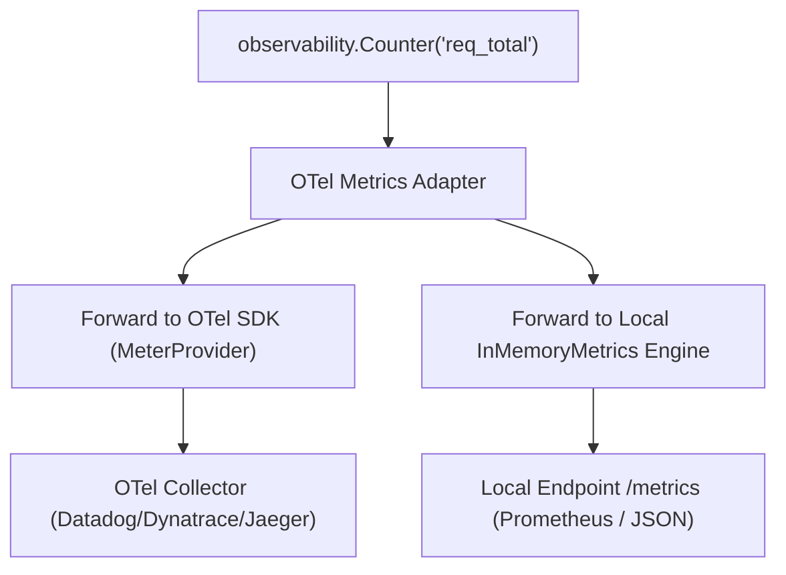

[](https://pkg.go.dev/github.com/wesleyskap/orkai-observability)     [](https://goreportcard.com/report/github.com/wesleyskap/orkai-observability)     [](https://github.com/wesleyskap/orkai-observability/actions/workflows/go.yml)   [](https://github.com/wesleyskap/orkai-observability/releases/latest "GitHub release")  [](https://www.codetriage.com/wesleyskap/orkai-observability)
 

# Orkai Observability

A modern, high-performance, lightweight observability package for Go backend services. It provides correlated structured JSON logging, thread-safe metrics collection, and LIFO nested parent-child trace spans under a single, unified facade interface.

---

## Package Integration Sequence

Step-by-step lifecycle flow of an incoming HTTP request executing nested operations (like database calls) inside a Go application using our package, highlighting how logs dynamically resolve trace IDs from the LIFO tracking stack.



### How It Works

1. **Automatic Trace Correlation:** When an incoming request starts, a unique Trace ID (e.g., `db3bda`) is generated and placed on a **LIFO (Last-In, First-Out) stack**. Think of this stack like a pile of plates: you add new IDs to the top, and always read or remove the top plate first.
2. **Context-Aware Logging:** Whenever you write a log (like calling `Info(...)`), the Logger automatically looks at the stack to grab the active ID currently on top. This correlates your logs without requiring you to manually pass Trace IDs as parameters to every single log function.
3. **Seamless Nesting (Sub-Traces):** If your code performs a nested operation (such as querying a database or calling another service), starting a new trace span generates a new child ID (e.g., `1b1ff7`) and pushes it onto the stack. Any logs written during the database call will automatically carry this new child ID.
4. **Self-Restoring Parent Context:** Once the database call finishes and its span ends, the child ID is popped off the stack. This immediately restores the parent's Trace ID (`db3bda`) back to the top of the stack. All subsequent logs written in the main handler will seamlessly carry the parent ID again.
5. **Thread-Safe Metrics:** Application-level events (counters, latencies, gauges) are recorded concurrently in-memory, completely protected against race conditions, and dumped into a formatted terminal report on demand.

---

## Features

* **Ultra-Fast JSON Logger:** A custom, reflection-free, structured logger that outputs directly to standard output or any custom `io.Writer`.
* **LIFO Nesting Traces:** An advanced, thread-safe LIFO trace stack that propagates unique cryptographically secure hex trace IDs. Sub-traces (e.g., DB queries) automatically nested inside parent spans correctly pop to restore the parent's active trace context on completion.
* **Thread-Safe Metrics:** In-memory tracking for cumulative counters, arithmetic average latencies over multi-sample periods, and decimal gauges—all protected under concurrent mutex locks.
* **Unified Facade API:** Clean, package-level package functions (`Info`, `Counter`, `StartSpan`) that automatically coordinate dynamic trace-log correlations seamlessly.
* **HTTP Tracing Middleware:** Reusable request wrapping that manages span traces, captures response statuses, and timing-logs endpoints out-of-the-box.
* **JSON Metrics Exporter:** Concurrent-safe live performance snapshots available under `/metrics` in a structured JSON payload.
* **Dynamic Log Level Rotation:** Atomic, lock-free runtime changes using `SetLogLevel` to adjust verbosity during live incidents without container restarts.
* **High-Performance Asynchronous Logging:** Non-blocking ring-buffer logging using Go channel concurrency with zero log loss saturation fallback to protect request critical paths.
* **Distributed context propagation:** End-to-end trace correlation boundaries carrying active spans across different microservices using W3C Trace Context and B3 propagation header standards.
* **Resilient Outbound Transport:** HTTP client decorators featuring a pure Go thread-safe Circuit Breaker state machine and exponential backoff retry policies for transient errors (503/504).
* **Advanced Metrics Percentiles:** Thread-safe memory-bounded sliding-window latency reservoirs (capped at 2000 samples) to compute accurate p50, p90, and p99 distributions.
* **Prometheus Cumulative Histograms:** Extended HTTP `/metrics` handler exporting latency metrics into scrapable Prometheus histogram blocks (`_bucket`, `_sum`, `_count`) alongside JSON.
* **OpenTelemetry (OTel) Semantic Bridge:** Semantic adapters (`NewOTelTracer`, `NewOTelMetrics`) mapping Orkai facades to the official `go.opentelemetry.io/otel` SDK with dual-routing and fallback.
* **HTTP Panic Recovery Middleware:** Intercepts unhandled panics inside HTTP handlers, logs the stack trace and panic details context-aware, records metrics, and returns a standardized `500 Internal Server Error` JSON response.
* **Periodic Go Runtime Metrics Collector:** Periodically captures and reports Go runtime diagnostics (goroutine counts, heap allocation/system memory bytes, and cumulative GC cycle runs) to the metrics system in a background loop.
* **SQL DB Query Tracing Helper:** An easy wrapper around SQL query execution that automatically spans the duration, counts queries, aggregates durations in metric histograms, and handles context trace correlation.
* **Size-Based Log Rotation File Writer:** A thread-safe, size-bounded `io.WriteCloser` implementation that rotates output log files automatically when size limits are reached and manages a configured backup depth limit.
* **Color Console Format (dev mode):** Replaces JSON logs with colored, human-readable console entries in local development environments when `Environment == "dev"`.
* **Internal Observability Telemetry:** Automatically tracks package health metrics like async buffer queue saturation (`observability_async_buffer_saturation_ratio`), rate-limiting drops (`observability_dropped_logs_total`), and internal I/O errors (`observability_internal_errors_total`).
* **Native OTLP HTTP/JSON Exporter:** Asynchronously exports captured local spans and logs to any OpenTelemetry collector over HTTP/JSON without requiring heavy external SDK dependencies.
* **Auto-Triggered pprof (On-Demand CPU & Heap Profiler):** Automatically triggers standard CPU and Heap profile captures (saved locally to disk) when system resources (goroutines or heap memory) exceed configured limits, managed with automated cooldown buffers to ensure process safety.

---

## Directory Structure

```txt
orkai-observability/
├── cmd/
│   └── api/
│       └── main.go         # API simulation entrypoint
├── observability/
│   ├── config.go           # Configuration validation
│   ├── context.go          # Context-aware helpers
│   ├── exporter.go         # Metrics HTTP Exporter
│   ├── limiter.go          # Rate limiting helpers
│   ├── logger.go           # High-performance structured JSON Logger
│   ├── metrics.go          # Concurrent safe in-memory metrics
│   ├── middleware.go       # Reusable HTTP Tracing & Logging Middleware
│   ├── observability.go    # Global Facade & package-level API
│   ├── otel_bridge.go      # OpenTelemetry SDK semantic adapters
│   ├── panic_middleware.go # HTTP Panic Recovery Middleware
│   ├── propagation.go      # Multi-standard context propagation
│   ├── resilience.go       # Circuit Breaker & Retry resilience engine
│   ├── rotating_file.go    # Size-Based Log Rotation File Writer
│   ├── sql_tracer.go       # SQL DB Query Tracing Helper
│   ├── sys_telemetry.go    # Periodic Go Runtime Metrics Collector
│   ├── tracer.go           # Thread-safe LIFO Trace Stack & cryptographics
│   ├── transport.go        # Outbound HTTP Client Tracing Transport
│   └── types.go            # Explicit types (Field, Span)
├── test/
│   ├── config_test.go      # Configuration validation tests
│   ├── exporter_test.go    # Exporter endpoint tests
│   ├── logger_test.go      # JSON Logger & dynamic levels tests
│   ├── metrics_test.go     # InMemory Metrics & snapshots tests
│   ├── middleware_test.go  # HTTP Middleware tests
│   ├── observability_test.go     # Global Facade tests
│   ├── otel_bridge_test.go       # OpenTelemetry bridge integration tests
│   ├── panic_middleware_test.go  # HTTP Panic Recovery Middleware tests
│   ├── percentiles_test.go # Latency percentiles & histogram tests
│   ├── resilience_test.go  # Circuit Breaker & Retry resilience tests
│   ├── rotating_file_test.go      # Rotating File Writer tests
│   ├── sql_tracer_test.go         # SQL DB Query Tracing Helper tests
│   ├── sys_telemetry_test.go      # System Runtime Metrics tests
│   ├── tracer_test.go            # LIFO Trace Stack tests
│   ├── transport_test.go         # Outbound HTTP Client Transport tests
│   └── types_test.go             # Explicit types tests
├── go.mod                  # Go module definition
├── .gitignore              # Standard Go repository rules
└── README.md               # Complete usage documentation
```

---

## Installation

Initialize or import the module in your Go project:

```bash
go get github.com/wesleyskap/orkai-observability/observability
```

---

## Quickstart

Here is how to initialize and use the observability package in a typical service handler workflow utilizing context-aware log correlation:

```go
package main

import (
	"context"
	"github.com/wesleyskap/orkai-observability/observability"
	"time"
)

func main() {
	// 1. Initialize the global facade
	cfg := observability.Config{
		ServiceName: "auth-service",
		Environment: "dev",
		LogLevel:    "info",
	}
	_ = observability.Init(cfg)

	// 2. Simulate a client handler request
	simulateRequest()

	// 3. Print metrics report to the terminal
	observability.Dump()
}

func simulateRequest() {
	start := time.Now()

	// Start a trace span (context-aware)
	ctx, span := observability.StartSpan(context.Background(), "LoginHandler")
	defer observability.EndSpan(span)

	// Logs automatically capture the active span's trace ID via context correlation
	observability.InfoContext(ctx, "login request received")

	// PII masking sanitization example
	observability.InfoContext(ctx, "user login attempt",
		observability.NewStringField("email", "john.doe@example.com"),
		observability.NewStringField("password", "super-secret-123"),
	)

	// Simulate a nested call (e.g. database query) passing the context
	mockDatabaseCall(ctx)

	// Restores the parent trace ID after the child span ends
	observability.InfoContext(ctx, "user authenticated successfully", observability.NewStringField("role", "admin"))

	// Track custom metrics
	observability.Counter("login_requests_total")
	observability.Latency("login_duration", time.Since(start))
}

func mockDatabaseCall(ctx context.Context) {
	// Nested span inherits correlation context and returns a child context
	dbCtx, span := observability.StartSpan(ctx, "DatabaseQuery")
	defer observability.EndSpan(span)

	observability.InfoContext(dbCtx, "executing select user query", observability.NewStringField("table", "users"))
	time.Sleep(15 * time.Millisecond) // Mock database latency
	observability.Counter("db_queries_total")
}
```

### Expected Output

Running the code above produces beautifully correlated, structured console logs with automatic PII masking:

```txt
[TRACE] Start LoginHandler trace_id=92a2ef510bebeb42
{"level":"INFO","service":"auth-service","trace_id":"92a2ef510bebeb42","msg":"login request received"}
{"level":"INFO","service":"auth-service","trace_id":"92a2ef510bebeb42","msg":"user login attempt","email":"[MASKED]","password":"[MASKED]"}
[TRACE] Start DatabaseQuery trace_id=38820f036cb47ab4
{"level":"INFO","service":"auth-service","trace_id":"38820f036cb47ab4","msg":"executing select user query","table":"users"}
[TRACE] End DatabaseQuery duration=15.4009ms
{"level":"INFO","service":"auth-service","trace_id":"92a2ef510bebeb42","msg":"user authenticated successfully","role":"admin"}
[TRACE] End LoginHandler duration=15.4009ms
=== METRICS ===
login_requests_total: 1
db_queries_total: 1
login_duration_latency_avg: 15.4009ms
```

---

## Advanced Usage: HTTP Middleware & JSON Exporter

Provides out-of-the-box integrations for high-performance HTTP web servers to automatically manage request trace lifecycles and expose scrapable telemetry.

### 1. HTTP Middleware

Simply wrap your router or mux handler with `observability.HTTPMiddleware` in a single line. It will automatically handle spans, log request start/end, and track request durations.

#### HTTP Request & Response Payload Logging

You can enable payload sampling to capture request and response bodies up to a configured size limit (e.g. for debugging):

```go
cfg := observability.Config{
	ServiceName:            "api-service",
	Environment:            "dev",
	EnablePayloadLogging:   true,
	PayloadLoggingSample:   0.1, // Sample 10% of requests (status >= 500 always gets logged)
	MaxPayloadLogSizeBytes: 2048, // Limit capture to 2KB
}
_ = observability.Init(cfg)

mux := http.NewServeMux()
mux.HandleFunc("/users", func(w http.ResponseWriter, req *http.Request) {
	w.WriteHeader(http.StatusOK)
	w.Write([]byte(`{"status":"success"}`))
})

http.ListenAndServe(":8080", observability.HTTPMiddleware(mux))
```

### 2. Live Metrics Exporter (JSON & Prometheus)

Expose `/metrics` dynamically for scrapers or dashboards using `observability.MetricsHTTPHandler()`. It natively supports both custom JSON payloads and the official Prometheus Text Exposition format:

```go
mux := http.NewServeMux()
// Exposes counters, gauges, and latencies
mux.HandleFunc("/metrics", observability.MetricsHTTPHandler())
```

- **JSON Format (Default):** Served on standard calls.
- **Prometheus Format:** Served when calling `/metrics?format=prometheus` or when sending request headers containing `Accept: text/plain`.

### 3. Dynamic Log Level Rotation

Change the active log level dynamically at runtime (e.g., to troubleshoot a live incident) without restarting your process:

```go
// Changes the global log level to "debug" on the fly!
observability.SetLogLevel("debug")
```

### 4. Outbound Context Propagation

Automatically propagate the active `X-Trace-ID` header across outgoing HTTP calls to other services/APIs using standard clients wrapped in `TracingRoundTripper`:

```go
// Creates an HTTP client carrying active parent span trace IDs in header payloads
client := observability.NewTracingClient()

// Executing calls now automatically forwards the active trace to downstream microservices!
resp, err := client.Get("https://api.external.service/users/me")
```

### 5. PII Log Masking & Sanitization

Protect sensitive PII (Personally Identifiable Information) data against accidental leakage in structured logs. The package automatically filters and obfuscates values when keys contain keywords like `password`, `token`, `secret`, `cvv`, `card`, `cpf`, or `email`:

Ensure strict compliance with data safety regulations (such as LGPD and GDPR) by automatically masking sensitive field values inside the structured JSON logs.

```go
// Logging sensitive data will automatically replace values with "[MASKED]"
observability.Info("user login attempt", 
	observability.NewStringField("email", "john.doe@example.com"),
	observability.NewStringField("password", "super-secret-123"),
)

// Serializes automatically with masked values:
// {"level":"INFO","msg":"user login attempt","email":"[MASKED]","password":"[MASKED]"}
```

#### Custom Sensitive Keys

Add custom PII keywords to the global log sanitization list at runtime:

```go
// Add custom keywords (case-insensitive)
observability.AddSensitiveKeys("socialSecurityNumber", "apiKey")
```

#### Regex-Based Value Sanitization (Regex Masking)

The package automatically scans all logged string field values for structured formats such as CPFs, JWT tokens, and Credit Cards, replacing matched substrings with `[MASKED_PATTERN]`, even if the field keys themselves are not registered as sensitive:

```go
// Even with a generic field name, sensitive patterns in values are obfuscated
observability.Info("transaction info", 
	observability.NewStringField("note", "Client CPF is 123.456.789-00"),
)
// Serializes as: {"level":"INFO","msg":"transaction info","note":"Client CPF is [MASKED_PATTERN]"}
```

You can also register custom regex patterns:

```go
observability.RegisterPIIPattern("cnpj", regexp.MustCompile(`\d{2}\.\d{3}\.\d{3}/\d{4}-\d{2}`))
```

### 6. Structured Error Stack Trace Capture

Accelerate incident investigations by automatically capturing Go call stack traces when recording errors. The package inspects runtime stack frames and appends a clean, compact string under the `"stack_trace"` field:

```go
// Captures stack frames automatically when logging an error
observability.Error("failed database operation", err, 
	observability.NewIntField("retry_count", 3),
)

// Serializes under the "stack_trace" JSON key:
// {"level":"ERROR","msg":"failed database operation","error":"timeout","stack_trace":"main.queryUser:42; main.handleRequest:20","retry_count":3}
```

### 7. Context-Aware Log Correlation

Simplify trace propagation in large microservice codebases by logging directly with context payloads. The package automatically resolves and correlates trace IDs carried inside `context.Context` parameters:

```go
// Securely inject trace ID to a standard context.Context
ctx := observability.ContextWithTraceID(context.Background(), "my-trace-id-123")

// Log using the context-aware API
observability.InfoContext(ctx, "processing incoming payment transaction", 
	observability.NewIntField("amount", 250),
)

// Serializes automatically with the correlated trace ID:
// {"level":"INFO","msg":"processing incoming payment transaction","trace_id":"my-trace-id-123","amount":250}
```

### 8. Dynamic Log Rate Limiting & Sampling

Protect central logging infrastructure (Elasticsearch, Loki, Datadog) and container performance during high-throughput failure events. The package utilizes a thread-safe token-bucket rate limiter that drops logs exceeding burst capabilities, falling back to a 10% diagnostic sample marked with `"log_burst_throttled": "true"`:

```go
// Enable rate limiting with a burst cap of 100 and replenishment rate of 50 logs/second
cfg := observability.Config{
	ServiceName:     "payment-gateway",
	Environment:     "production",
	LogLevel:        "info",
	EnableRateLimit: true,
	RateLimitBurst:  100,
	RateLimitRate:   50,
}
_ = observability.Init(cfg)

// Excessive logging under pressure will automatically trigger rate-limiting,
// dropping 90% of spam logs while printing 10% for diagnostic samples:
// {"level":"INFO","msg":"handling order checkout","log_burst_throttled":"true"}
```

#### Transparent Integration

Because rate limiting is integrated natively inside the global logging engine, downstream services (such as API gateway routers or business logic controllers) do not require **any** modifications. 

Simply configure the limits once at application startup during facade initialization:

```go
package main

import (
	"github.com/wesleyskap/orkai-observability/observability"
)

func main() {
	// Initialize once during startup
	cfg := observability.Config{
		ServiceName:     "auth-service",
		Environment:     "production",
		LogLevel:        "info",
		EnableRateLimit: true,
		RateLimitBurst:  200, // Maximum burst allowance
		RateLimitRate:   100, // Token replenishment per second
	}
	_ = observability.Init(cfg)
}
```

Now, all your existing and future log calls across the entire project (whether standard or context-aware) are automatically protected:

```go
// This log statement automatically inherits rate-limiting and sampling:
observability.InfoContext(ctx, "executing SQL transaction", observability.NewStringField("db", "users"))
```

#### Decision Flow Diagram



#### On-Demand Refill & Replenishment Sequence

The `LogRateLimiter` computes elapsed time deltas mathematically during active calls, completely avoiding the overhead of dedicated background tick routines or timers:



#### Architectural Highlights

1. **Lock-Free Replenishment Performance:** The internal mathematical time delta calculation completely avoids resource-intensive background goroutines or ticking timers, ensuring near-zero processing overhead under heavy concurrency.
2. **Intelligent Diagnostic Sampling:** The 10% sampling algorithm ensures that severe infinite logging loops (e.g. rapid database outages) do not choke container CPU resources or saturate centralized log ingestion storage (Elasticsearch, Loki, Datadog), while still preserving critical trace context samples for Grafana dashboards.

### 9. Multi-Dimensional Metrics (Labels/Tags)

Perform deep diagnostic drill-downs by segmenting metrics using labels (tags) matching modern TSDB (Time Series Databases) like Prometheus:

```go
// Increment a counter segmented by method and HTTP status code
observability.CounterWithLabels("http_requests_total", map[string]string{
	"method": "POST",
	"status": "201",
})

// Record average latency segmented by API handler
observability.LatencyWithLabels("http_request_duration_ms", 45*time.Millisecond, map[string]string{
	"handler": "user_signup",
})

// Set gauge segmented by database cluster node
observability.GaugeWithLabels("db_connections_active", 14, map[string]string{
	"node": "primary-01",
})
```

#### Scrapable Formats

1. **Prometheus Exposition Text Format:** When queried via `GET /metrics?format=prometheus`, the exporter formats labels alphabetically and splits base names for helper tags perfectly:
   ```text
   # HELP http_requests_total Cumulative counter of http_requests_total
   # TYPE http_requests_total counter
   http_requests_total{method="POST",status="201"} 1
   ```
2. **JSON Snapshot Format:** Standard queries render beautifully grouped keys compatible with JSON decoders:
   ```json
   {
     "counters": {
       "http_requests_total{method=\"POST\",status=\"201\"}": 1
     }
   }
   ```

### 10. Distributed Trace Context Propagation (W3C / B3 Standards)

Achieve end-to-end transactional observability across distributed microservice boundaries. The package automatically injects active trace contexts into outbound client requests and extracts them from incoming HTTP handler boundaries, conforming to the modern universal **W3C Trace Context** and classic **B3** propagation standards:

```go
// 1. In your HTTP Client (Outbound Request):
// Create a client equipped with our tracing round-tripper
client := observability.NewTracingClient()

// Inject W3C baggage in context
ctx = observability.ContextWithBaggage(ctx, map[string]string{"tenant_id": "corp-a", "user_role": "admin"})

// Make request - trace context and baggage are injected automatically
req, _ := http.NewRequestWithContext(ctx, "GET", "https://api.internal/profile", nil)
resp, err := client.Do(req)

// 2. In your downstream Microservice HTTP Handler (Inbound Request):
// The HTTPMiddleware automatically extracts trace context and baggage, restoring context
mux := http.NewServeMux()
mux.HandleFunc("/profile", func(w http.ResponseWriter, r *http.Request) {
    // The logger automatically resolves the parent trace ID and outputs baggage fields (e.g., "baggage.tenant_id": "corp-a")
    observability.InfoContext(r.Context(), "handling profile lookup")
})
loggedRouter := observability.HTTPMiddleware(mux)
```

#### Supported Formats

1. **W3C traceparent:** Standardized header carrying format: `00-{trace_id}-{span_id}-{trace_flags}` (e.g. `traceparent: 00-4bf92f3577b34da6a3ce929d0e0e4736-00f067aa0ba902b7-01`).
2. **B3 Single Header:** Portable single header syntax: `{trace_id}-{span_id}-{sampled}` (e.g. `b3: 4bf92f3577b34da6a3ce929d0e0e4736-00f067aa0ba902b7-1`).
3. **Legacy correlation:** Simple fallback matching the custom `X-Trace-ID` header.

#### Distributed Sequence Flow Diagram



### Architectural Highlights
* **Seamless Stack Preservation:** Trace propagation works lock-free, preserving parent-child relationships across service networks without requiring complex sidecars.
* **Standardized Context Headers:** Supports modern universal W3C traceparent as the primary propagation standard and B3 Single Header as a portable fallback for broad legacy environment integration.
* **Zero-Configuration Controller Injection:** Write standard Go context logging calls, and all serialization and propagation rules are resolved by the logging engine automatically under the hood.

### 11. High-Performance Asynchronous Ring-Buffer Logging

Eliminate log-writing I/O bottlenecks in performance-critical request handler execution paths. The package supports queueing serialized log entries in a thread-safe buffered channel, offloading physical I/O output streaming to a dedicated background flusher worker goroutine:

```go
cfg := observability.Config{
	ServiceName:         "ultra-fast-api",
	Environment:         "production",
	LogLevel:            "info",
	EnableAsyncLog:      true, // Enable asynchronous background logging
	AsyncLogChannelSize: 8192, // Buffered ring-buffer channel queue size
}
_ = observability.Init(cfg)

// Graceful shutdown on application exit (flushes all remaining logs in the queue)
defer observability.Close()
```

#### Resilient Drop-Free Saturation Fallback

Under massive burst load where the ring-buffer channel becomes saturated, the logging engine automatically falls back to drop-free synchronous writes to protect operational logging telemetry. This completely bounds memory footprint while preventing silent telemetry loss.



### 12. Resilient Outbound Transport (Circuit Breaker & Retry)

Protect microservices from cascading failures when calling remote APIs or sending remote telemetry over the wire. The resilience engine provides a thread-safe Circuit Breaker state machine coupled with dynamic HTTP client decorators:

```go
// 1. Initialize a thread-safe Circuit Breaker
// Ratio threshold = 50% failures, trip after 5 consecutive errors, 30s cooldown
cb := observability.NewCircuitBreaker(0.50, 5, 30*time.Second)

// 2. Wrap outbound HTTP Client Transport with Retry & Circuit Breaker policies
// Maximum 3 retries, base exponential backoff delay of 100ms
resilientTransport := observability.NewResilientRoundTripper(
	http.DefaultTransport, 
	cb, 
	3, 
	100*time.Millisecond,
)

client := &http.Client{
	Transport: resilientTransport,
	Timeout:   5 * time.Second,
}
```

#### State Machine Flowchart



### 13. Advanced Metrics Histograms & Percentiles (p50, p90, p99)

Accurately diagnose long-tail latency spikes (e.g. cold starts, garbage collection pauses) that are typically hidden by standard flat averages. The metrics engine contains a thread-safe sliding window reservoir that tracks percentile distributions (p50, p90, p99) and exports them in standard Prometheus cumulative histogram bucket formats:

```go
// 1. Record latencies normally
observability.Latency("http_duration", 12*time.Millisecond)
observability.Latency("http_duration", 150*time.Millisecond)

// 2. Fetch the metrics summary snapshot
summary := observability.GetSummary()
pct := summary.Percentiles["http_duration"]
fmt.Printf("Median: %g ms, 99th Percentile: %g ms\n", pct.P50, pct.P99)
```

#### Memory-Bounded Sliding Window Reservoir

To prevent unbounded memory growth in high-throughput production environments, each latency metric key allocates a lock-protected reservoir capped at **2000 samples**. When the reservoir saturates, older observations are evicted in a sliding-window fashion, keeping statistical distributions fresh and representative of recent traffic patterns.



#### Scrapable Formats

1. **Prometheus Text exposition Format (`GET /metrics?format=prometheus`):**
   Exposes standard cumulative `_bucket{le="..."}` counters, along with the required `_sum` and `_count` lines:
   ```text
   # HELP http_duration Histogram of latency in milliseconds for http_duration
   # TYPE http_duration histogram
   http_duration_bucket{le="5"} 0
   http_duration_bucket{le="10"} 0
   http_duration_bucket{le="25"} 1
   http_duration_bucket{le="50"} 1
   http_duration_bucket{le="100"} 1
   http_duration_bucket{le="250"} 2
   http_duration_bucket{le="500"} 2
   http_duration_bucket{le="1000"} 2
   http_duration_bucket{le="2500"} 2
   http_duration_bucket{le="5000"} 2
   http_duration_bucket{le="+Inf"} 2
   http_duration_sum 162
   http_duration_count 2
   ```
2. **JSON Summary Payload:**
   Exposes computed percentiles alongside raw average latencies and cumulative bucket maps:
   ```json
   {
     "counters": {},
     "latencies": {
       "http_duration": 81.0
     },
     "percentiles": {
       "http_duration": {
         "p50": 12.0,
         "p90": 150.0,
         "p99": 150.0
       }
     },
     "histograms": {
       "http_duration": {
         "5": 0,
         "10": 0,
         "25": 1,
         "50": 1,
         "100": 1,
         "250": 2,
         "500": 2,
         "1000": 2,
         "2500": 2,
         "5000": 2,
         "+Inf": 2
       }
     },
     "gauges": {}
   }
   ```

---

### 14. OpenTelemetry (OTel) Semantic Bridge

Enable seamless integration with the global OpenTelemetry standard without vendor lock-in. The semantic adapter allows mapping our custom tracing and metrics interfaces directly to native OpenTelemetry SDKs (`go.opentelemetry.io/otel`), protecting your codebase from third-party API churn while staying fully compatible with modern SaaS observability backends (Datadog, Grafana Cloud, Dynatrace, New Relic, etc.).

```go
// 1. Configure the global facade to route directly to native OpenTelemetry providers
cfg := observability.Config{
	ServiceName:        "payment-service",
	Environment:        "production",
	LogLevel:           "info",
	EnableOTel:         true, // Route all telemetry directly to OpenTelemetry APIs
	OTelTracerProvider: otel.GetTracerProvider(),
	OTelMeterProvider:  otel.GetMeterProvider(),
}
_ = observability.Init(cfg)

// 2. Tracing and Metrics calls translate automatically to OTel instruments
ctx, span := observability.StartSpan(context.Background(), "AuthorizePayment")
defer observability.EndSpan(span)

observability.Counter("transactions_processed")
```

#### Dual Local-OTel Telemetry Architecture

To preserve local debugging capabilities, the `otelMetrics` adapter implements a dual-route architecture. While telemetry events are instantly translated and pushed to the standard OpenTelemetry SDK, they are also aggregated inside our internal memory engine. This ensures that the local scrapable Prometheus handler (`/metrics`) and JSON snapshots (`GetSummary()`) continue to function perfectly!



---

### 15. HTTP Panic Recovery Middleware

Provides safety and reliability for HTTP servers by recovering from unhandled handler panics, logging the stack trace, recording metrics, and returning a structured JSON response.

Simply wrap your HTTP handlers using [PanicRecoveryMiddleware](file:///c:/Users/User/develop/estudo/orkai-observability/observability/panic_middleware.go#L9):

```go
package main

import (
	"net/http"
	"github.com/wesleyskap/orkai-observability/observability"
)

func main() {
	cfg := observability.Config{ServiceName: "user-service", Environment: "production"}
	_ = observability.Init(cfg)
	defer observability.Close()

	mux := http.NewServeMux()
	mux.HandleFunc("/panic", func(w http.ResponseWriter, req *http.Request) {
		panic("something went terribly wrong!")
	})

	// Wrap mux with PanicRecoveryMiddleware
	http.ListenAndServe(":8080", observability.PanicRecoveryMiddleware(mux))
}
```

When a panic occurs:
1. It is caught by the middleware.
2. The panic reason and stack trace are logged context-aware under [panic_middleware.go](file:///c:/Users/User/develop/estudo/orkai-observability/observability/panic_middleware.go).
3. The counter metric `http_panics_total` is incremented.
4. An RFC-7807/standardized `500 Internal Server Error` response is returned:
   ```json
   {"error":"Internal Server Error"}
   ```

---

### 16. Periodic Go Runtime Metrics Collector

Collects memory allocations, heap statistics, garbage collections, and goroutine counts on a customizable ticker interval.

Enable Go runtime metrics telemetry by setting configuration flags during initialization:

```go
package main

import (
	"context"
	"time"
	"github.com/wesleyskap/orkai-observability/observability"
)

func main() {
	cfg := observability.Config{
		ServiceName:             "worker-service",
		Environment:             "production",
		EnableSystemTelemetry:   true,             // Enable background collection
		SystemTelemetryInterval: 5 * time.Second,  // Sample every 5 seconds
	}
	_ = observability.Init(cfg)
	defer observability.Close()

	// Application runtime code...
	time.Sleep(15 * time.Second)
}
```

The system automatically spins up a background telemetry loop under [sys_telemetry.go](file:///c:/Users/User/develop/estudo/orkai-observability/observability/sys_telemetry.go) and writes metrics that can be queried from `/metrics` or standard dumps:
- `go_goroutines`: Number of active goroutines.
- `go_mem_heap_alloc_bytes`: Bytes of allocated heap objects.
- `go_mem_heap_sys_bytes`: Bytes of heap memory obtained from the OS.
- `go_gc_completed_count`: Number of completed GC cycles.

---

### 17. SQL DB Query Tracing Helper

Automates SQL query duration tracing, status logging, and metric recording.

Use [TraceSQL](file:///c:/Users/User/develop/estudo/orkai-observability/observability/sql_tracer.go#L9) inside query execution wrappers:

```go
package repository

import (
	"context"
	"database/sql"
	"github.com/wesleyskap/orkai-observability/observability"
)

type UserRepository struct {
	db *sql.DB
}

func (r *UserRepository) GetUserByID(ctx context.Context, id int) (string, error) {
	// Automatically generates span "SQL:SELECT:users" and returns end callback
	traceCtx, endTrace := observability.TraceSQL(ctx, "SELECT", "users")
	defer endTrace()

	var name string
	err := r.db.QueryRowContext(traceCtx, "SELECT name FROM users WHERE id = ?", id).Scan(&name)
	if err != nil {
		observability.ErrorContext(traceCtx, "query failed", err)
		return "", err
	}

	return name, nil
}
```

Features:
- Dynamically generates nested LIFO trace spans named `SQL:<operation>:<table>`.
- Records latency metrics under the key `db_query_duration_ms` with tags `query_type` and `table`.
- Seamlessly propagates context-aware trace correlation IDs down the call chain.
- **Slow Query Alerts:** Automatically logs a warning entry (`WARN`) when a query duration exceeds the configured threshold.

To enable slow query tracking, set configuration options during startup:
```go
cfg := observability.Config{
	ServiceName:          "user-service",
	Environment:          "production",
	EnableSlowQueryAlert: true,
	SlowQueryThreshold:   100 * time.Millisecond, // Alert on queries exceeding 100ms
}
_ = observability.Init(cfg)
```

---

### 18. Size-Based Log Rotation File Writer

A thread-safe, size-bounded file writer that rotates logs automatically once a threshold is reached and manages a configured backup depth limit.

You can configure it directly via [Config](file:///c:/Users/User/develop/estudo/orkai-observability/observability/config.go#L28) at startup:

```go
package main

import (
	"github.com/wesleyskap/orkai-observability/observability"
)

func main() {
	cfg := observability.Config{
		ServiceName:       "api-service",
		Environment:       "production",
		LogFilePath:       "/var/log/app.log",
		LogFileMaxSize:    10 * 1024 * 1024, // 10 Megabytes max file size
		LogFileMaxBackups: 5,                // Maintain up to 5 backups
	}
	_ = observability.Init(cfg)
	defer observability.Close()

	// Logs will now be automatically written to /var/log/app.log and rotated!
	observability.Info("app started successfully")
}
```

Alternatively, instantiate [RotatingFileWriter](file:///c:/Users/User/develop/estudo/orkai-observability/observability/rotating_file.go#L10) manually for custom files:

```go
package main

import (
	"github.com/wesleyskap/orkai-observability/observability"
)

func main() {
	// Create a writer targeting a log file with 1MB max size and 3 backups max
	writer, err := observability.NewRotatingFileWriter("custom.log", 1024*1024, 3)
	if err != nil {
		panic(err)
	}
	defer writer.Close()

	_, _ = writer.Write([]byte("custom rotating log line\n"))
}
```

---

### 19. Native OTLP HTTP/JSON Exporter

Asynchronously exports captured local spans and logs to any OpenTelemetry collector over HTTP/JSON without requiring heavy external SDK dependencies.

Configure OTLP export parameters during application startup:

```go
package main

import (
	"context"
	"time"
	"github.com/wesleyskap/orkai-observability/observability"
)

func main() {
	cfg := observability.Config{
		ServiceName:    "my-service",
		Environment:    "production",
		OTLPEndpoint:   "http://localhost:4318", // OTLP Collector JSON endpoint
		ExportInterval: 2 * time.Second,         // Batch export every 2s
		OTLPHeaders: map[string]string{
			"Authorization": "Bearer my-token",
		},
	}
	_ = observability.Init(cfg)
	defer observability.Close()

	// Tracing and logging automatically triggers background OTLP exporting!
	ctx, span := observability.StartSpan(context.Background(), "Task")
	observability.InfoContext(ctx, "executing business logic")
	observability.EndSpan(span)
}
```

---

## Running Tests

Our tests are fully isolated inside the `/test` directory, exercising the public API of the package just like a real client application:

```bash
$ go test -v ./test/...
=== RUN   TestValidateConfigValid
--- PASS: TestValidateConfigValid (0.00s)
=== RUN   TestValidateConfigEmptyService
--- PASS: TestValidateConfigEmptyService (0.00s)
=== RUN   TestValidateConfigEmptyEnv
--- PASS: TestValidateConfigEmptyEnv (0.00s)
=== RUN   TestMetricsHTTPHandlerSuccess
--- PASS: TestMetricsHTTPHandlerSuccess (0.00s)
=== RUN   TestMetricsHTTPHandlerPrometheus
--- PASS: TestMetricsHTTPHandlerPrometheus (0.00s)
=== RUN   TestMetricsHTTPHandlerPrometheusLabels
--- PASS: TestMetricsHTTPHandlerPrometheusLabels (0.00s)
=== RUN   TestJSONLoggerInfo
--- PASS: TestJSONLoggerInfo (0.00s)
=== RUN   TestJSONLoggerError
--- PASS: TestJSONLoggerError (0.00s)
=== RUN   TestJSONLoggerDynamicLevel
--- PASS: TestJSONLoggerDynamicLevel (0.00s)
=== RUN   TestJSONLoggerPIIMasking
--- PASS: TestJSONLoggerPIIMasking (0.00s)
=== RUN   TestJSONLoggerErrorStackTrace
--- PASS: TestJSONLoggerErrorStackTrace (0.00s)
=== RUN   TestLGPDCompliance
--- PASS: TestLGPDCompliance (0.00s)
=== RUN   TestJSONLoggerContextTraceCorrelation
--- PASS: TestJSONLoggerContextTraceCorrelation (0.00s)
=== RUN   TestLogRateLimitingDrops
--- PASS: TestLogRateLimitingDrops (0.00s)
=== RUN   TestLogRateLimitingSamples
--- PASS: TestLogRateLimitingSamples (0.00s)
=== RUN   TestAsyncLoggerSuccess
--- PASS: TestAsyncLoggerSuccess (0.00s)
=== RUN   TestAsyncLoggerSaturation
--- PASS: TestAsyncLoggerSaturation (0.00s)
=== RUN   TestMetricsIncrement
--- PASS: TestMetricsIncrement (0.00s)
=== RUN   TestMetricsLatency
--- PASS: TestMetricsLatency (0.00s)
=== RUN   TestMetricsGauge
--- PASS: TestMetricsGauge (0.00s)
=== RUN   TestMetricsCounterWithLabels
--- PASS: TestMetricsCounterWithLabels (0.00s)
=== RUN   TestMetricsLatencyWithLabels
--- PASS: TestMetricsLatencyWithLabels (0.00s)
=== RUN   TestMetricsGaugeWithLabels
--- PASS: TestMetricsGaugeWithLabels (0.00s)
=== RUN   TestHTTPMiddlewareNewTrace
[TRACE] Start /users trace_id=6f9b7348e9b4258f
{"level":"INFO","service":"test","trace_id":"6f9b7348e9b4258f","msg":"incoming request started","method":"POST","path":"/users"}
{"level":"INFO","service":"test","trace_id":"6f9b7348e9b4258f","msg":"outgoing request finished","method":"POST","path":"/users","status":201,"duration_ms":0}
[TRACE] End /users duration=0s
--- PASS: TestHTTPMiddlewareNewTrace (0.00s)
=== RUN   TestHTTPMiddlewareResumedTrace
{"level":"INFO","service":"test","trace_id":"db3bda","msg":"incoming request started","method":"GET","path":"/profile"}
{"level":"INFO","service":"test","trace_id":"db3bda","msg":"outgoing request finished","method":"GET","path":"/profile","status":200,"duration_ms":0}
[TRACE] End /profile duration=0s
--- PASS: TestHTTPMiddlewareResumedTrace (0.00s)
=== RUN   TestHTTPMiddlewareW3CTrace
{"level":"INFO","service":"test","trace_id":"4bf92f3577b34da6a3ce929d0e0e4736","msg":"incoming request started","method":"GET","path":"/profile"}
{"level":"INFO","service":"test","trace_id":"4bf92f3577b34da6a3ce929d0e0e4736","msg":"outgoing request finished","method":"GET","path":"/profile","status":200,"duration_ms":0}
[TRACE] End /profile duration=0s
--- PASS: TestHTTPMiddlewareW3CTrace (0.00s)
=== RUN   TestHTTPMiddlewareB3Trace
{"level":"INFO","service":"test","trace_id":"80f198ee56343ba8","msg":"incoming request started","method":"GET","path":"/profile"}
{"level":"INFO","service":"test","trace_id":"80f198ee56343ba8","msg":"outgoing request finished","method":"GET","path":"/profile","status":200,"duration_ms":0}
[TRACE] End /profile duration=0s
--- PASS: TestHTTPMiddlewareB3Trace (0.00s)
=== RUN   TestGlobalFacadeInit
--- PASS: TestGlobalFacadeInit (0.00s)
=== RUN   TestGlobalFacadeDelegation
{"level":"INFO","service":"test-service","msg":"delegated log","key":"val"}
[TRACE] Start test-span trace_id=5b47e8143e5c80df
[TRACE] End test-span duration=0s
=== METRICS ===
test_count: 1
test_latency_latency_avg: 10ms
test_gauge: 10.5
--- PASS: TestGlobalFacadeDelegation (0.00s)
=== RUN   TestOTelBridgeTracing
--- PASS: TestOTelBridgeTracing (0.00s)
=== RUN   TestOTelBridgeMetrics
--- PASS: TestOTelBridgeMetrics (0.00s)
=== RUN   TestOTelBridgeLogCorrelation
--- PASS: TestOTelBridgeLogCorrelation (0.00s)
=== RUN   TestMetricsPercentilesCalculation
--- PASS: TestMetricsPercentilesCalculation (0.00s)
=== RUN   TestMetricsHistogramBuckets
--- PASS: TestMetricsHistogramBuckets (0.00s)
=== RUN   TestPrometheusExporterHistogram
--- PASS: TestPrometheusExporterHistogram (0.00s)
=== RUN   TestCircuitBreakerTransitionsToOpen
--- PASS: TestCircuitBreakerTransitionsToOpen (0.00s)
=== RUN   TestCircuitBreakerTransitionsToClosed
--- PASS: TestCircuitBreakerTransitionsToClosed (0.02s)
=== RUN   TestResilientRoundTripperCircuitTrip
--- PASS: TestResilientRoundTripperCircuitTrip (0.00s)
=== RUN   TestResilientRoundTripperExponentialRetry
--- PASS: TestResilientRoundTripperExponentialRetry (0.00s)
=== RUN   TestTracerStart
--- PASS: TestTracerStart (0.00s)
=== RUN   TestTracerEnd
--- PASS: TestTracerEnd (0.00s)
=== RUN   TestTracingRoundTripperNoActiveTrace
--- PASS: TestTracingRoundTripperNoActiveTrace (0.00s)
=== RUN   TestTracingRoundTripperActiveTrace
--- PASS: TestTracingRoundTripperActiveTrace (0.00s)
=== RUN   TestNewStringField
--- PASS: TestNewStringField (0.00s)
=== RUN   TestNewIntField
--- PASS: TestNewIntField (0.00s)
PASS
ok  	github.com/wesleyskap/orkai-observability/test	0.740s
```

---

## License

This project is licensed under the MIT License - see the LICENSE file for details.
