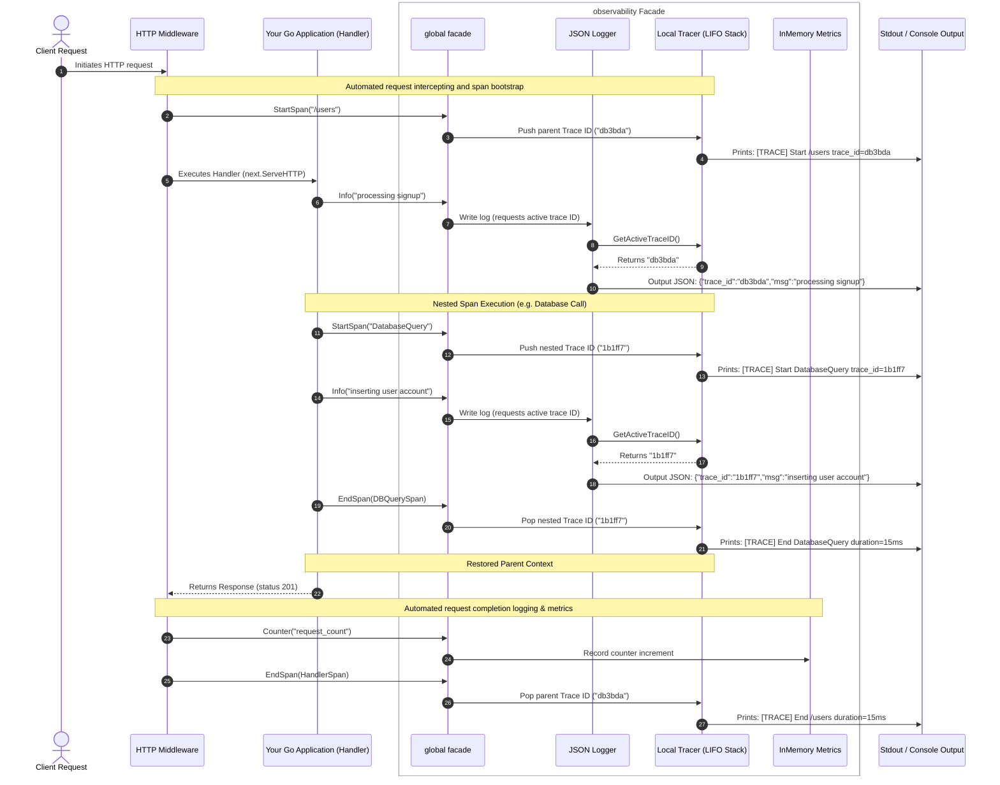
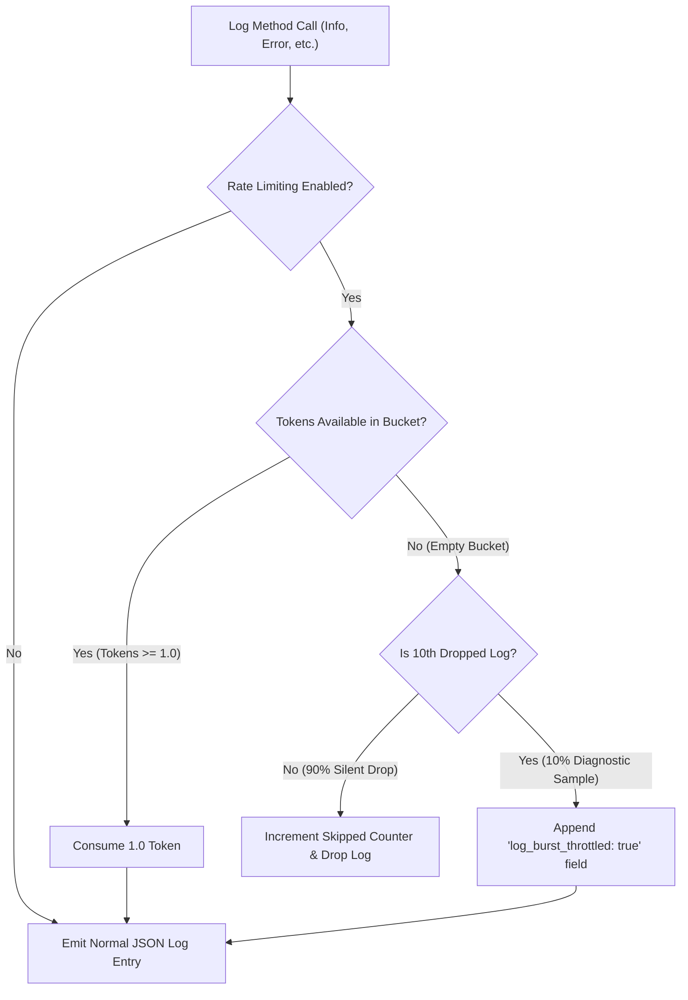
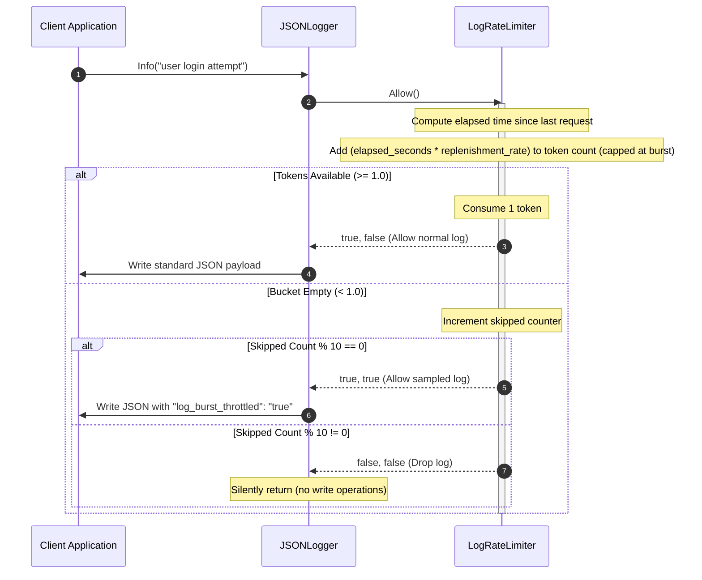
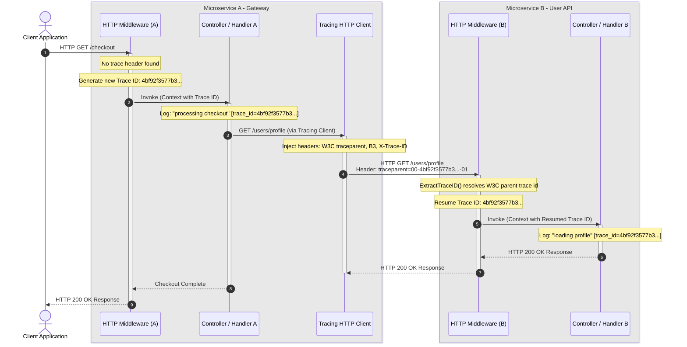

[](https://pkg.go.dev/github.com/wesleyskap/orkai-observability)     [](https://goreportcard.com/report/github.com/wesleyskap/orkai-observability)     [](https://github.com/wesleyskap/orkai-observability/actions/workflows/go.yml)   [](https://github.com/wesleyskap/orkai-observability/releases/latest "GitHub release")  [](https://www.codetriage.com/wesleyskap/orkai-observability)
 

# Orkai Observability

A modern, high-performance, lightweight observability package for Go backend services. It provides correlated structured JSON logging, thread-safe metrics collection, and LIFO nested parent-child trace spans under a single, unified facade interface.

---

## Package Integration Sequence

Step-by-step lifecycle flow of an incoming HTTP request executing nested operations (like database calls) inside a Go application using our package, highlighting how logs dynamically resolve trace IDs from the LIFO tracking stack.



### How It Works

1. **Automatic Trace Correlation:** When an incoming request starts, a unique Trace ID (e.g., `db3bda`) is generated and placed on a **LIFO (Last-In, First-Out) stack**. Think of this stack like a pile of plates: you add new IDs to the top, and always read or remove the top plate first.
2. **Context-Aware Logging:** Whenever you write a log (like calling `Info(...)`), the Logger automatically looks at the stack to grab the active ID currently on top. This correlates your logs without requiring you to manually pass Trace IDs as parameters to every single log function.
3. **Seamless Nesting (Sub-Traces):** If your code performs a nested operation (such as querying a database or calling another service), starting a new trace span generates a new child ID (e.g., `1b1ff7`) and pushes it onto the stack. Any logs written during the database call will automatically carry this new child ID.
4. **Self-Restoring Parent Context:** Once the database call finishes and its span ends, the child ID is popped off the stack. This immediately restores the parent's Trace ID (`db3bda`) back to the top of the stack. All subsequent logs written in the main handler will seamlessly carry the parent ID again.
5. **Thread-Safe Metrics:** Application-level events (counters, latencies, gauges) are recorded concurrently in-memory, completely protected against race conditions, and dumped into a formatted terminal report on demand.

---

## Features

* **Ultra-Fast JSON Logger:** A custom, reflection-free, structured logger that outputs directly to standard output or any custom `io.Writer`.
* **LIFO Nesting Traces:** An advanced, thread-safe LIFO trace stack that propagates unique cryptographically secure hex trace IDs. Sub-traces (e.g., DB queries) automatically nested inside parent spans correctly pop to restore the parent's active trace context on completion.
* **Thread-Safe Metrics:** In-memory tracking for cumulative counters, arithmetic average latencies over multi-sample periods, and decimal gauges—all protected under concurrent mutex locks.
* **Unified Facade API:** Clean, package-level package functions (`Info`, `Counter`, `StartSpan`) that automatically coordinate dynamic trace-log correlations seamlessly.
* **HTTP Tracing Middleware:** Reusable request wrapping that manages span traces, captures response statuses, and timing-logs endpoints out-of-the-box.
* **JSON Metrics Exporter:** Concurrent-safe live performance snapshots available under `/metrics` in a structured JSON payload.
* **Dynamic Log Level Rotation:** Atomic, lock-free runtime changes using `SetLogLevel` to adjust verbosity during live incidents without container restarts.

---

## Directory Structure

```txt
orkai-observability/
├── cmd/
│   └── api/
│       └── main.go         # API simulation entrypoint
├── observability/
│   ├── config.go           # Configuration validation
│   ├── exporter.go         # Metrics HTTP Exporter
│   ├── logger.go           # High-performance structured JSON Logger
│   ├── metrics.go          # Concurrent safe in-memory metrics
│   ├── middleware.go       # Reusable HTTP Tracing & Logging Middleware
│   ├── observability.go    # Global Facade & package-level API
│   ├── tracer.go           # Thread-safe LIFO Trace Stack & cryptographics
│   ├── transport.go        # Outbound HTTP Client Tracing Transport
│   └── types.go            # Explicit types (Field, Span)
├── test/
│   ├── config_test.go      # Configuration validation tests
│   ├── exporter_test.go    # Exporter endpoint tests
│   ├── logger_test.go      # JSON Logger & dynamic levels tests
│   ├── metrics_test.go     # InMemory Metrics & snapshots tests
│   ├── middleware_test.go  # HTTP Middleware tests
│   ├── observability_test.go     # Global Facade tests
│   ├── tracer_test.go            # LIFO Trace Stack tests
│   ├── transport_test.go         # Outbound HTTP Client Transport tests
│   └── types_test.go             # Explicit types tests
├── go.mod                  # Go module definition
├── .gitignore              # Standard Go repository rules
└── README.md               # Complete usage documentation
```

---

## Installation

Initialize or import the module in your Go project:

```bash
go get github.com/wesleyskap/orkai-observability/observability
```

---

## Quickstart

Here is how to initialize and use the observability package in a typical service handler workflow utilizing context-aware log correlation:

```go
package main

import (
	"context"
	"github.com/wesleyskap/orkai-observability/observability"
	"time"
)

func main() {
	// 1. Initialize the global facade
	cfg := observability.Config{
		ServiceName: "auth-service",
		Environment: "dev",
		LogLevel:    "info",
	}
	_ = observability.Init(cfg)

	// 2. Simulate a client handler request
	simulateRequest()

	// 3. Print metrics report to the terminal
	observability.Dump()
}

func simulateRequest() {
	start := time.Now()

	// Start a trace span (context-aware)
	ctx, span := observability.StartSpan(context.Background(), "LoginHandler")
	defer observability.EndSpan(span)

	// Logs automatically capture the active span's trace ID via context correlation
	observability.InfoContext(ctx, "login request received")

	// PII masking sanitization example
	observability.InfoContext(ctx, "user login attempt",
		observability.NewStringField("email", "john.doe@example.com"),
		observability.NewStringField("password", "super-secret-123"),
	)

	// Simulate a nested call (e.g. database query) passing the context
	mockDatabaseCall(ctx)

	// Restores the parent trace ID after the child span ends
	observability.InfoContext(ctx, "user authenticated successfully", observability.NewStringField("role", "admin"))

	// Track custom metrics
	observability.Counter("login_requests_total")
	observability.Latency("login_duration", time.Since(start))
}

func mockDatabaseCall(ctx context.Context) {
	// Nested span inherits correlation context and returns a child context
	dbCtx, span := observability.StartSpan(ctx, "DatabaseQuery")
	defer observability.EndSpan(span)

	observability.InfoContext(dbCtx, "executing select user query", observability.NewStringField("table", "users"))
	time.Sleep(15 * time.Millisecond) // Mock database latency
	observability.Counter("db_queries_total")
}
```

### Expected Output

Running the code above produces beautifully correlated, structured console logs with automatic PII masking:

```txt
[TRACE] Start LoginHandler trace_id=92a2ef510bebeb42
{"level":"INFO","service":"auth-service","trace_id":"92a2ef510bebeb42","msg":"login request received"}
{"level":"INFO","service":"auth-service","trace_id":"92a2ef510bebeb42","msg":"user login attempt","email":"[MASKED]","password":"[MASKED]"}
[TRACE] Start DatabaseQuery trace_id=38820f036cb47ab4
{"level":"INFO","service":"auth-service","trace_id":"38820f036cb47ab4","msg":"executing select user query","table":"users"}
[TRACE] End DatabaseQuery duration=15.4009ms
{"level":"INFO","service":"auth-service","trace_id":"92a2ef510bebeb42","msg":"user authenticated successfully","role":"admin"}
[TRACE] End LoginHandler duration=15.4009ms
=== METRICS ===
login_requests_total: 1
db_queries_total: 1
login_duration_latency_avg: 15.4009ms
```

---

## Advanced Usage: HTTP Middleware & JSON Exporter

Provides out-of-the-box integrations for high-performance HTTP web servers to automatically manage request trace lifecycles and expose scrapable telemetry.

### 1. HTTP Middleware

Simply wrap your router or mux handler with `observability.HTTPMiddleware` in a single line. It will automatically handle spans, log request start/end, and track request durations:

```go
package main

import (
	"net/http"
	"github.com/wesleyskap/orkai-observability/observability"
)

func main() {
	cfg := observability.Config{ServiceName: "api-service", Environment: "prod"}
	_ = observability.Init(cfg)

	mux := http.NewServeMux()
	mux.HandleFunc("/hello", func(w http.ResponseWriter, req *http.Request) {
		w.WriteHeader(http.StatusOK)
		_, _ = w.Write([]byte("Hello, World!"))
	})

	// Wrap mux in a single line to enable full HTTP Tracing & Logging!
	http.ListenAndServe(":8080", observability.HTTPMiddleware(mux))
}
```

### 2. Live Metrics Exporter (JSON & Prometheus)

Expose `/metrics` dynamically for scrapers or dashboards using `observability.MetricsHTTPHandler()`. It natively supports both custom JSON payloads and the official Prometheus Text Exposition format:

```go
mux := http.NewServeMux()
// Exposes counters, gauges, and latencies
mux.HandleFunc("/metrics", observability.MetricsHTTPHandler())
```

- **JSON Format (Default):** Served on standard calls.
- **Prometheus Format:** Served when calling `/metrics?format=prometheus` or when sending request headers containing `Accept: text/plain`.

### 3. Dynamic Log Level Rotation

Change the active log level dynamically at runtime (e.g., to troubleshoot a live incident) without restarting your process:

```go
// Changes the global log level to "debug" on the fly!
observability.SetLogLevel("debug")
```

### 4. Outbound Context Propagation

Automatically propagate the active `X-Trace-ID` header across outgoing HTTP calls to other services/APIs using standard clients wrapped in `TracingRoundTripper`:

```go
// Creates an HTTP client carrying active parent span trace IDs in header payloads
client := observability.NewTracingClient()

// Executing calls now automatically forwards the active trace to downstream microservices!
resp, err := client.Get("https://api.external.service/users/me")
```

### 5. PII Log Masking & Sanitization

Protect sensitive PII (Personally Identifiable Information) data against accidental leakage in structure logs. The package automatically filters and obfuscates values when keys contain keywords like `password`, `token`, `secret`, `cvv`, `card`, `cpf`, or `email`:

Ensure strict compliance with data safety regulations (such as LGPD and GDPR) by automatically masking sensitive field values inside the structured JSON logs.

```go
// Logging sensitive data will automatically replace values with "[MASKED]"
observability.Info("user login attempt", 
	observability.NewStringField("email", "john.doe@example.com"),
	observability.NewStringField("password", "super-secret-123"),
)

// Serializes automatically with masked values:
// {"level":"INFO","msg":"user login attempt","email":"[MASKED]","password":"[MASKED]"}
```

#### Custom Sensitive Keys

Add custom PII keywords to the global log sanitization list at runtime:

```go
// Add custom keywords (case-insensitive)
observability.AddSensitiveKeys("socialSecurityNumber", "apiKey")
```

### 6. Structured Error Stack Trace Capture

Accelerate incident investigations by automatically capturing Go call stack traces when recording errors. The package inspects runtime stack frames and appends a clean, compact string under the `"stack_trace"` field:

```go
// Captures stack frames automatically when logging an error
observability.Error("failed database operation", err, 
	observability.NewIntField("retry_count", 3),
)

// Serializes under the "stack_trace" JSON key:
// {"level":"ERROR","msg":"failed database operation","error":"timeout","stack_trace":"main.queryUser:42; main.handleRequest:20","retry_count":3}
```

### 7. Context-Aware Log Correlation

Simplify trace propagation in large microservice codebases by logging directly with context payloads. The package automatically resolves and correlates trace IDs carried inside `context.Context` parameters:

```go
// Securely inject trace ID to a standard context.Context
ctx := observability.ContextWithTraceID(context.Background(), "my-trace-id-123")

// Log using the context-aware API
observability.InfoContext(ctx, "processing incoming payment transaction", 
	observability.NewIntField("amount", 250),
)

// Serializes automatically with the correlated trace ID:
// {"level":"INFO","msg":"processing incoming payment transaction","trace_id":"my-trace-id-123","amount":250}
```

### 8. Dynamic Log Rate Limiting & Sampling

Protect central logging infrastructure (Elasticsearch, Loki, Datadog) and container performance during high-throughput failure events. The package utilizes a thread-safe token-bucket rate limiter that drops logs exceeding burst capabilities, falling back to a 10% diagnostic sample marked with `"log_burst_throttled": "true"`:

```go
// Enable rate limiting with a burst cap of 100 and replenishment rate of 50 logs/second
cfg := observability.Config{
	ServiceName:     "payment-gateway",
	Environment:     "production",
	LogLevel:        "info",
	EnableRateLimit: true,
	RateLimitBurst:  100,
	RateLimitRate:   50,
}
_ = observability.Init(cfg)

// Excessive logging under pressure will automatically trigger rate-limiting,
// dropping 90% of spam logs while printing 10% for diagnostic samples:
// {"level":"INFO","msg":"handling order checkout","log_burst_throttled":"true"}
```

#### Zero-Boilerplate Integration

Because rate limiting is integrated natively inside the global logging engine, downstream services (such as API gateway routers or business logic controllers) do not require **any** modifications. 

Simply configure the limits once at application startup during facade initialization:

```go
package main

import (
	"github.com/wesleyskap/orkai-observability/observability"
)

func main() {
	// Initialize once during startup
	cfg := observability.Config{
		ServiceName:     "auth-service",
		Environment:     "production",
		LogLevel:        "info",
		EnableRateLimit: true,
		RateLimitBurst:  200, // Maximum burst allowance
		RateLimitRate:   100, // Token replenishment per second
	}
	_ = observability.Init(cfg)
}
```

Now, all your existing and future log calls across the entire project (whether standard or context-aware) are automatically protected:

```go
// This log statement automatically inherits rate-limiting and sampling:
observability.InfoContext(ctx, "executing SQL transaction", observability.NewStringField("db", "users"))
```

#### Decision Flow Diagram



#### On-Demand Refill & Replenishment Sequence

The `LogRateLimiter` computes elapsed time deltas mathematically during active calls, completely avoiding the overhead of dedicated background tick routines or timers:



#### Architectural Highlights

1. **Lock-Free Replenishment Performance:** The internal mathematical time delta calculation completely avoids resource-intensive background goroutines or ticking timers, ensuring near-zero processing overhead under heavy concurrency.
2. **Intelligent Diagnostic Sampling:** The 10% sampling algorithm ensures that severe infinite logging loops (e.g. rapid database outages) do not choke container CPU resources or saturate centralized log ingestion storage (Elasticsearch, Loki, Datadog), while still preserving critical trace context samples for Grafana dashboards.

### 9. Multi-Dimensional Metrics (Labels/Tags)

Perform deep diagnostic drill-downs by segmenting metrics using labels (tags) matching modern TSDB (Time Series Databases) like Prometheus:

```go
// Increment a counter segmented by method and HTTP status code
observability.CounterWithLabels("http_requests_total", map[string]string{
	"method": "POST",
	"status": "201",
})

// Record average latency segmented by API handler
observability.LatencyWithLabels("http_request_duration_ms", 45*time.Millisecond, map[string]string{
	"handler": "user_signup",
})

// Set gauge segmented by database cluster node
observability.GaugeWithLabels("db_connections_active", 14, map[string]string{
	"node": "primary-01",
})
```

#### Scrapable Formats

1. **Prometheus Exposition Text Format:** When queried via `GET /metrics?format=prometheus`, the exporter formats labels alphabetically and splits base names for helper tags perfectly:
   ```text
   # HELP http_requests_total Cumulative counter of http_requests_total
   # TYPE http_requests_total counter
   http_requests_total{method="POST",status="201"} 1
   ```
2. **JSON Snapshot Format:** Standard queries render beautifully grouped keys compatible with JSON decoders:
   ```json
   {
     "counters": {
       "http_requests_total{method=\"POST\",status=\"201\"}": 1
     }
   }
   ```

### 10. Distributed Trace Context Propagation (W3C / B3 Standards)

Achieve end-to-end transactional observability across distributed microservice boundaries. The package automatically injects active trace contexts into outbound client requests and extracts them from incoming HTTP handler boundaries, conforming to the modern universal **W3C Trace Context** and classic **B3** propagation standards:

```go
// 1. In your HTTP Client (Outbound Request):
// Create a client equipped with our tracing round-tripper
client := observability.NewTracingClient()

// Make request - trace context (W3C traceparent and b3 headers) is injected automatically
req, _ := http.NewRequestWithContext(ctx, "GET", "https://api.internal/profile", nil)
resp, err := client.Do(req)

// 2. In your downstream Microservice HTTP Handler (Inbound Request):
// The HTTPMiddleware automatically extracts trace context, restoring the lineage
mux := http.NewServeMux()
mux.HandleFunc("/profile", func(w http.ResponseWriter, r *http.Request) {
    // The logger automatically resolves and correlates the parent trace ID
    observability.InfoContext(r.Context(), "handling profile lookup")
})
loggedRouter := observability.HTTPMiddleware(mux)
```

#### Supported Formats

1. **W3C traceparent:** Standardized header carrying format: `00-{trace_id}-{span_id}-{trace_flags}` (e.g. `traceparent: 00-4bf92f3577b34da6a3ce929d0e0e4736-00f067aa0ba902b7-01`).
2. **B3 Single Header:** Portable single header syntax: `{trace_id}-{span_id}-{sampled}` (e.g. `b3: 4bf92f3577b34da6a3ce929d0e0e4736-00f067aa0ba902b7-1`).
3. **Legacy correlation:** Simple fallback matching the custom `X-Trace-ID` header.

#### Distributed Sequence Flow Diagram



### Architectural Highlights
* **Seamless Stack Preservation:** Trace propagation works lock-free, preserving parent-child relationships across service networks without requiring complex sidecars.
* **Standardized Context Headers:** Supports modern universal W3C traceparent as the primary propagation standard and B3 Single Header as a portable fallback for broad legacy environment integration.
* **Zero-Configuration Controller Injection:** Write standard Go context logging calls, and all serialization and propagation rules are resolved by the logging engine automatically under the hood.

---

## Running Tests

Our tests are fully isolated inside the `/test` directory, exercising the public API of the package just like a real client application:

```bash
$ go test -v ./test/...
=== RUN   TestValidateConfigValid
--- PASS: TestValidateConfigValid (0.00s)
=== RUN   TestValidateConfigEmptyService
--- PASS: TestValidateConfigEmptyService (0.00s)
=== RUN   TestValidateConfigEmptyEnv
--- PASS: TestValidateConfigEmptyEnv (0.00s)
=== RUN   TestMetricsHTTPHandlerSuccess
--- PASS: TestMetricsHTTPHandlerSuccess (0.00s)
=== RUN   TestMetricsHTTPHandlerPrometheus
--- PASS: TestMetricsHTTPHandlerPrometheus (0.00s)
=== RUN   TestMetricsHTTPHandlerPrometheusLabels
--- PASS: TestMetricsHTTPHandlerPrometheusLabels (0.00s)
=== RUN   TestJSONLoggerInfo
--- PASS: TestJSONLoggerInfo (0.00s)
=== RUN   TestJSONLoggerError
--- PASS: TestJSONLoggerError (0.00s)
=== RUN   TestJSONLoggerDynamicLevel
--- PASS: TestJSONLoggerDynamicLevel (0.00s)
=== RUN   TestJSONLoggerPIIMasking
--- PASS: TestJSONLoggerPIIMasking (0.00s)
=== RUN   TestJSONLoggerErrorStackTrace
--- PASS: TestJSONLoggerErrorStackTrace (0.00s)
=== RUN   TestLGPDCompliance
--- PASS: TestLGPDCompliance (0.00s)
=== RUN   TestJSONLoggerContextTraceCorrelation
--- PASS: TestJSONLoggerContextTraceCorrelation (0.00s)
=== RUN   TestLogRateLimitingDrops
--- PASS: TestLogRateLimitingDrops (0.00s)
=== RUN   TestLogRateLimitingSamples
--- PASS: TestLogRateLimitingSamples (0.00s)
=== RUN   TestMetricsIncrement
--- PASS: TestMetricsIncrement (0.00s)
=== RUN   TestMetricsLatency
--- PASS: TestMetricsLatency (0.00s)
=== RUN   TestMetricsGauge
--- PASS: TestMetricsGauge (0.00s)
=== RUN   TestMetricsCounterWithLabels
--- PASS: TestMetricsCounterWithLabels (0.00s)
=== RUN   TestMetricsLatencyWithLabels
--- PASS: TestMetricsLatencyWithLabels (0.00s)
=== RUN   TestMetricsGaugeWithLabels
--- PASS: TestMetricsGaugeWithLabels (0.00s)
=== RUN   TestHTTPMiddlewareNewTrace
[TRACE] Start /users trace_id=d866d73440ae9367
{"level":"INFO","service":"test","trace_id":"d866d73440ae9367","msg":"incoming request started","method":"POST","path":"/users"}
{"level":"INFO","service":"test","trace_id":"d866d73440ae9367","msg":"outgoing request finished","method":"POST","path":"/users","status":201,"duration_ms":0}
[TRACE] End /users duration=0s
--- PASS: TestHTTPMiddlewareNewTrace (0.00s)
=== RUN   TestHTTPMiddlewareResumedTrace
{"level":"INFO","service":"test","trace_id":"db3bda","msg":"incoming request started","method":"GET","path":"/profile"}
{"level":"INFO","service":"test","trace_id":"db3bda","msg":"outgoing request finished","method":"GET","path":"/profile","status":200,"duration_ms":0}
[TRACE] End /profile duration=0s
--- PASS: TestHTTPMiddlewareResumedTrace (0.00s)
=== RUN   TestGlobalFacadeInit
--- PASS: TestGlobalFacadeInit (0.00s)
=== RUN   TestGlobalFacadeDelegation
{"level":"INFO","service":"test-service","msg":"delegated log","key":"val"}
[TRACE] Start test-span trace_id=b35091c721bd3132
[TRACE] End test-span duration=0s
=== METRICS ===
test_count: 1
test_latency_latency_avg: 10ms
test_gauge: 10.5
--- PASS: TestGlobalFacadeDelegation (0.00s)
=== RUN   TestTracerStart
--- PASS: TestTracerStart (0.00s)
=== RUN   TestTracerEnd
--- PASS: TestTracerEnd (0.00s)
=== RUN   TestTracingRoundTripperNoActiveTrace
--- PASS: TestTracingRoundTripperNoActiveTrace (0.00s)
=== RUN   TestTracingRoundTripperActiveTrace
--- PASS: TestTracingRoundTripperActiveTrace (0.00s)
=== RUN   TestNewStringField
--- PASS: TestNewStringField (0.00s)
=== RUN   TestNewIntField
--- PASS: TestNewIntField (0.00s)
PASS
ok  	github.com/wesleyskap/orkai-observability/test	0.704s
```

---

## License

This project is licensed under the MIT License - see the LICENSE file for details.
